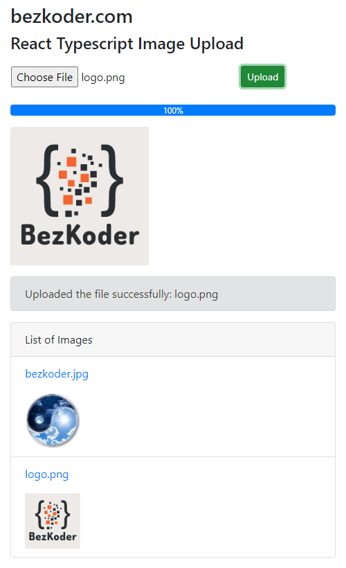

# Image Upload with React Typescript example
React Typescript Image Upload example with Preview, Progress Bar using Axios, Bootstrap, Multipart File, FormData.



For instruction, please visit:
> [React Typescript Image Upload example (with Preview)](https://www.bezkoder.com/upload-image-react-typescript/)

More Practice:
> [React Typescript CRUD example](https://www.bezkoder.com/react-typescript-api-call/)

> [React Typescript Custom Hook](https://www.bezkoder.com/react-custom-hook-typescript/)

> [React Hook Form Typescript example with Validation](https://www.bezkoder.com/react-hook-form-typescript/)

> [React Table example: CRUD App with react-table v7](https://www.bezkoder.com/react-table-example-hooks-crud/)

> [React Pagination using Hooks example](https://www.bezkoder.com/react-pagination-hooks/)

> [React Typescript JWT Authentication & Authorization example](https://www.bezkoder.com/react-typescript-authentication-example/)

> [React + Redux + Hooks: JWT Authentication & Authorization example](https://www.bezkoder.com/react-hooks-redux-login-registration-example/)

Fullstack with Node Express:
> [React + Node Express + MySQL](https://www.bezkoder.com/react-node-express-mysql/)

> [React + Node Express + PostgreSQL](https://www.bezkoder.com/react-node-express-postgresql/)

> [React + Node Express + MongoDB](https://www.bezkoder.com/react-node-express-mongodb-mern-stack/)

Fullstack with Spring Boot:
> [React + Spring Boot + MySQL](https://www.bezkoder.com/react-spring-boot-crud/)

> [React + Spring Boot + PostgreSQL](https://www.bezkoder.com/spring-boot-react-postgresql/)

> [React + Spring Boot + MongoDB](https://www.bezkoder.com/react-spring-boot-mongodb/)

Fullstack with Django:
> [React Hooks + Django Rest Framework](https://www.bezkoder.com/django-react-hooks/)

Serverless with Firebase:
> [React Typescript Firebase example: CRUD App](https://www.bezkoder.com/firebase-typescript-react/)

> [React Typescript Firestore example: CRUD App](https://www.bezkoder.com/react-typescript-firestore/)

This project was bootstrapped with [Create React App](https://github.com/facebook/create-react-app).

### Set port
.env
```
PORT=8081
```

## Project setup

In the project directory, you can run:

```
npm install
# or
yarn install
```

or

### Compiles and hot-reloads for development

```
npm start
# or
yarn start
```

Open [http://localhost:8081](http://localhost:8081) to view it in the browser.

The page will reload if you make edits.
